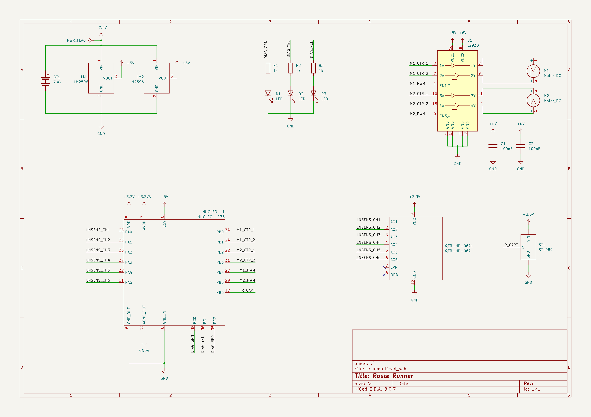
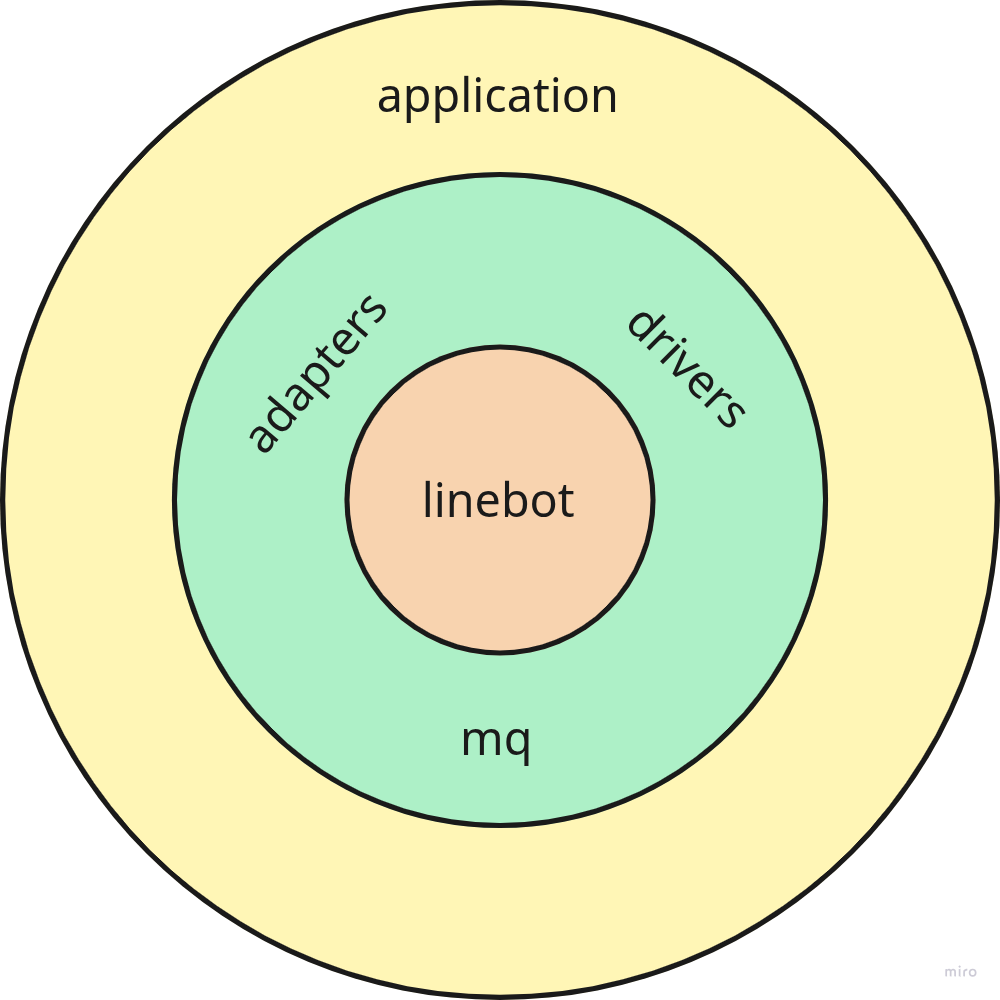

# Route Runner

## Table of contents

- [Overview](#overview)
- [Usage](#usage)
    - [Command referene](#command-reference)
    - [Dualshock 2 command mapping](#command---dualshock2-mapping)
    - [Modes reference](#modes-reference)
    - [LED modes mapping](#modes---led-indicator-mapping)
- [Hardware](#hardware)
    - [Power supply](#power-supply)
    - [GPIO usage summary](#gpio-usage-summary)
    - [Other peripherals usage summary](#other-peripheral-usage-summary)
    - [Electrical schematics](#electrical-schematics)
- [Software](#software)
    - [Build and flash](#build-and-flash)
    - [Application architecture](#application-architecture)

## Overview
Route runner is a name of the line following robot project. It is built using the following components:
* STM32 NUCLEO-F303 board as a microcontroller
* 2 DC motors driven by simple L293D driver
* Pololu's QTR-HD-06A line sensor
* Dualshock2 remote control
* 1 mode indicator LED
* Two LM2596 step-down voltage converters with the following settings:
    * 7V for the motors
    * 5V for the MCU and L293D logic

For the power details visit the [Power supply](#power-supply) section

## Usage
* Turn on the device using ON/OFF switch. Mode indicator displays MANUAL CONTROL mode.
* Place the vehicle or simply run it on the black line. Mode indicator displays DETECTED state. 
* Start line following by issuing FOLLOW command. Mode indicator displays TRACKING state.

### Command reference
* FORWARD - move forward
* BACKWARD - move backward
* RIGHT - turn right
* LEFT - turn left
* FOLLOW - start tracking the route
* BREAK - stop stracking

### Command - dualshock2 mapping
* FORWARD - R2
* BACKWARD - L2
* RIGHT - R2 or L2 + RIGHT
* LEFT - R2 or L2 + LEFT
* FOLLOW - CROSS
* BREAK - CIRCLE

### Modes reference
* MANUAL - vehicle can be manually controlled
* DETECTED - vehicle sees the route beneath
* TRACKING - either FOLLOWING or RECOVERING
* FOLLOWING - vehicle sees and follows the route
* RECOVERING - vehicle does not see but still tries to get back on the route

> Note that the RECOVERING mode lasts only for 500ms unless route runner gets back on the route. After that time the vehicle will stop tracking.

### Modes - LED indicator mapping
* MANUAL - 1 short blink per second
* DETECTED - 2 short blinks per second
* TRACKING - 4 short blinks per second

short blink is a sequence `on -> off` with 250ms duration

## Hardware
* The line sensor is positioned at 4mm above the surface and the calibration is hardcoded.


### Power supply
The device is powered by two 18650 Li-ion 2500mAh 20A baterries of total voltage equal to 7.4V (3.7V each). The power buses are distributed as follows:
* 7V power bus provided by one of the LM2596 voltage converter. Used by L293D for DC motor inputs. Note that due to quite high voltage drops on L293D the effective voltage for DC motors whould oscilate around ~5V. This is not impressive and is the area to improve in the further project iterations.
* 5V power bus provided by the second LM2596 voltage converter. Used by L293D logic and the MCU
* 3.3V power bus provided by MCU. Used by the Dualshock2 receiver and state indicator
* 3.3V analog power bus provided by MCU. Used by line sensor
* Common GND bus for all components

### GPIO usage summary
* Motion:
    * **PB0** (D3) - PWM (tim3, ch3) for left motor
    * PB6 (D5) - A1 for right motor
    * PB7 (D4) - A2 for right motor
    * **PB1** (D6) - PWM (tim3, ch4) for right motor
    * PA10 (D0) - A2 for left motor
    * PA12 (D2) - A1 for left motor
* Remote control:
    * **PB5** (D11) - MOSI
    * **PB4** (D12) - MISO
    * **PB3** (D13) - SCK
    * PF0 (D7) - CS
* Line sensing:
    * *PA1* (A1) - channel 1
    * *PA3* (A2) - channel 2
    * *PA4* (A3) - channel 3
    * *PA5* (A4) - channel 4
    * *PA6* (A5) - channel 5
    * *PA7* (A6) - channel 6
* Status indicator
    * **PA8** (D9)

### Other peripheral usage summary
* TIM2 channel 1 - timer for (dualshock2) MANUAL CONTROL communication trigger
* TIM3 channel 4 - timer for PWM signal for left motor (PB1)
* TIM3 channel 3 - timer for PWM signal for right motor (PB0)
* TIM1 channel 1 - timer for (LED) status indicator (by toggle on compare)
* TIM6 - timer trigger for ADC conversion by TRGO, every 1ms
* TIM15 - off route guard
* ADC in dual mode with DMA controller for conversions readings

Pins in **bold** are unchangeable. *Italic* pin change may implicate other changes.

### Electrical schematics


## Software

### Build and flash

```bash
# build

cmake -DCMAKE_BUILD_TYPE=Debug -DCMAKE_TOOLCHAIN_FILE=arm-none-eabi-gcc.cmake -B build/Debug
cmake --build build/Debug

# flash
st-flash write build/Debug/app/route-runner.bin 0x08000000
```

### Application architecture

Software architecture is inspired by the hexagonal (ports and adapters) pattern. The main goal of this approach was to be abe to embed the domain into any other MCU platform, wherher to use RTOS or bare metal, with or without STM32 HAL, etc. Any infrastructure change must not imply the domain logic changes.


