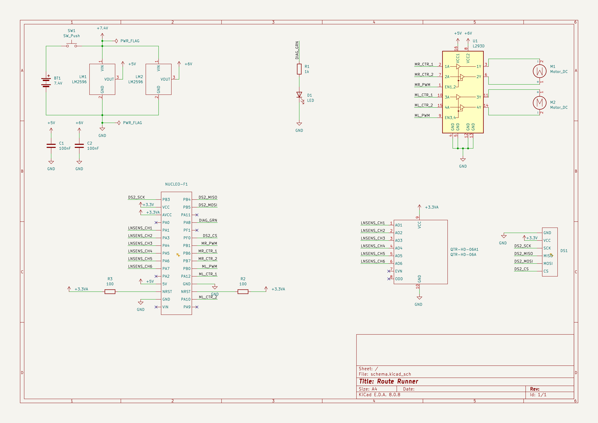

# Route Runner

Route runner is a name of the line following robot project. It is built using the following components:
* STM32 NUCLEO-L476 board as a microcontroller
* 2 DC motors driven by simple L293D component
* Pololu's QTR-HD-06A line sensor
* ST1089 infrared receiver for the NEC-compatibile remote
* 3 diagnostic LEDs
* Two LM2596 step-down voltage converters with the following settings:
    * 6V for the motors
    * 5V for the MCU and L293D logic

For the power details visit the [Power supply](#power-supply) section


## Usage
* Turn on the device using ON/OFF switch. Green LED should start blinking which indicates the STANDBY state.
* Place the vehicle on the black line so that it aligns with its vertical axis. The green LED should stop blinking which indicates the READY state.
* Press "Play" button on the remote. The vehicle should now start following the line and the yellow LED should turn on. Green LED should turn off.

### Command reference
* STANDBY - put vehicle into STANDBY state.
* RUN - start following the line. Note that the vehicle must be in READY state before.
* SPEED+ - increase the speed of the vehicle.
* SPEED- - decrease the speed of the vehicle.

### Command - remote mapping
* STANDBY - POWER
* RUN - PLAY
* SPEED+ - PLUS
* SPEED- - MINUS

### State reference
* Green LED blinking - STANDBY state. The vehicle waits to be placed on the black line on the white background.
* Green LED turned on - READY state. The vehicle waits for the RUN command
* Yellow LED turned on - RUNNING state. The vehicle is following the line
* Red LED turned on - generic error.

### Troubleshoot
* Red LED turned on - press STANDBY and follow the usage procedure from the second step.

## Technical info
* The line sensor is positioned at 4mm above the surface and the calibration is hardcoded.

### Power supply
The device is powered by two 18650 Li-ion 2500mAh 20A baterries of total voltage equal to 7.4V (3.7V each). From the power source the following power buses are distributed:
* 6V power bus provided by one of the LM2596 voltage converter. Used by L293D for DC motor inputs.
* 5V power bus provided by the second LM2596 voltage converter. Used by L293D logic and the MCU
* 3.3V power bus provided by MCU. Used by the IR receiver and diagnostic LEDs
* 3.3V analog power bus provided by MCU. Used by line sensor
* Common GND bus for all digital components
* Analog GND bus for the line sensor

### Electrical wiring diagram


## Development

```bash
# build

cmake -DCMAKE_BUILD_TYPE=Debug -DCMAKE_TOOLCHAIN_FILE=arm-none-eabi-gcc.cmake -B build/Debug
cmake --build build/Debug

# flash
st-flash write build/Debug/app/route-runner.bin 0x08000000


```