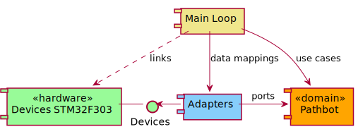
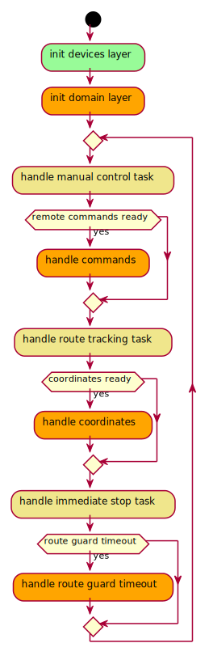
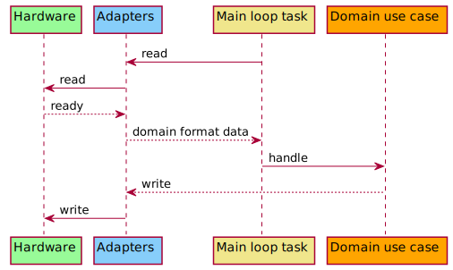
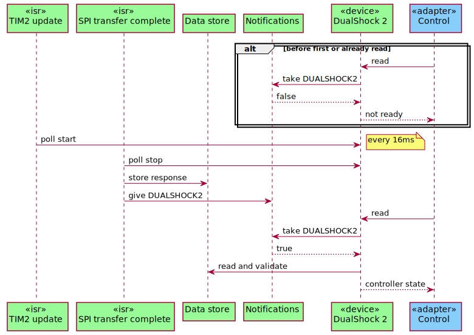
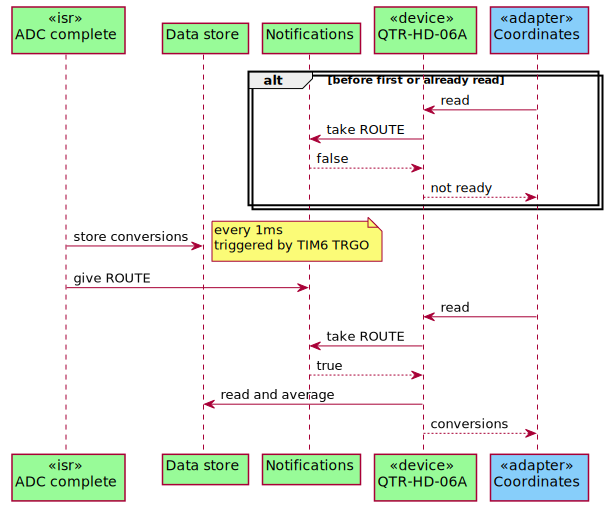
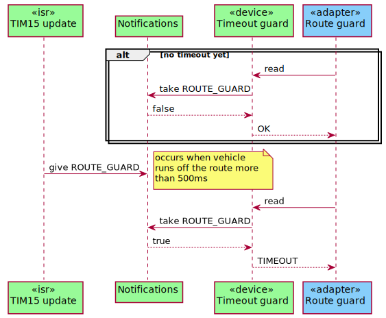
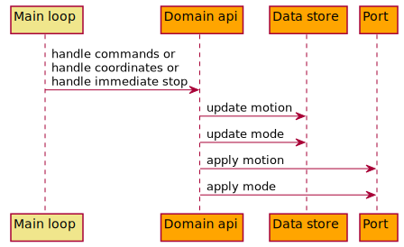

# Line Follower - a study in embedded system coding paradigms

## Table of contents

---

1. [Executive summary](#executive-summary)
1. [Project overview](#project-overview)
1. [System design](#system-design)
1. [Implementation](#implementation)
    1. [Development tools](#development-tools)
    1. [Design patterns](#design-patterns)
        1. [Object and opaque ~~pointer~~ handle](#object-and-opaque-pointer-handle)
        1. [Notifications](#notifications)
        1. [Data store](#data-store)
1. [Reflections and retrospective](#reflections-and-retrospective)
1. [Debugging tales and surprises](#debugging-tales-and-surprises)
1. [Summary and future work](#summary-and-future-work)
1. [Appendices](#appendices)


## Executive summary

---

There are many ways to learn new and interesting skills.
For me, as a software engineer with experiance in backend Java and Kotlin development, exploring embedded systems has been a refreshing and challenging shift.
I find learning by doing both effective and rewarding, so I decided to build a classic robotics project: a line-following robot.
This project helped me gain a deeper understanding of embedded development principles, experiment with coding paradigms in the C language, and apply hexagonal architecture in a resource-constrained environment.
I created this case study to reflect on that experiance and share what I learned - including successes, trade-offs, and things I would approach differently in the future.

## Project Overview

---

<!---

This section describes capabilities of the robot, i.e. manual control, route tracking, emergency stop.
Also, it summarizes the components from which the robot is built: MCU platform, DC motors and drivers, line sensor, remote control.
It mentions about perfboard assembly with THT soldering technique

--->

The primary capabilities and requirements of the robot were:

- Manual movement via remote control  
- Quick and smooth line tracking, triggered on demand  
- Emergency stop (manual and automatic)  
- LED indicator showing the current operational mode  

To build the robot, I used the following components:

- **Microcontroller**: STM32F303K8 on the ST Nucleo board  
- **Motors**: 2x N20-BT29 micro DC motors (75:1, 400 RPM, 9V)  
- **Motor driver**: L293D  
- **Line sensor**: Pololu QTR-HD-06A (6 IR emitter and phototransistor pairs, analog output)  
- **Remote control**: Custom DualShock 2 with wireless receiver  
- **Indicator**: Mode indicator LED  

  

As we all know, an electrical device works better when it's actually connected to a power source.
To power the line-following robot, I used **two 18650 Li-Ion batteries** connected in series.
Each battery has a capacity of **2500 mAh**, voltage of **3.7 V**, and a continuous discharge current of **20 A**.
This configuration is both inexpensive and well-suited to the L293D motor driver’s requirements.

The power distribution is organized as follows:

- **Main power supply**: 2x 18650 Li-Ion batteries in series, providing a total of **7.4 V**
- **7 V rail**: Regulated by the first LM2596 step-down converter, powering the L293D motor inputs  
- **5 V rail**: Regulated by the second LM2596 converter, used for the L293D logic and the Nucleo board  
- **3.3 V rail**: Supplied by the Nucleo board, powering the DualShock 2 receiver and mode LED  
- **3.3 V analog rail**: Also from the Nucleo board, powering the QTR-HD-06A line sensor  

  

And last but not least, everything is topped off with a good old-fashioned **ON/OFF toggle switch**.

## System design

---

<!---

This section summarizes the application architecture and flow organization.
It contains some basic diagrams.
It mentions about a superloop approach with indepentent tasks in contrast to state machine (or should it be in Implementation section?)

--->

<div hidden>
```
@startuml app-architecture

[Main Loop] as main #khaki
() "Devices" as devices #palegreen
[Devices STM32F303] as hardware <<hardware>> #palegreen 
[Adapters] as adapters #lightskyblue
[Pathbot] as domain <<domain>> #orange 

main -down-> adapters : data mappings
main --> domain : use cases
main ..> hardware : links
adapters -right-> domain : ports
adapters -left-> devices
hardware -right- devices 

@enduml
```
</div>



The application architecture is inspired by the hexagonal architecture pattern, also known as ports and adapters.
At the core sits the domain logic component, called Pathbot_.
It is fully isolated - it does not depend on any other layer and is completely agnostic of the hardware platform.
It exposes _use cases_ that are triggered by the main loop and declares ports that are defined by adapters.

The adapters component serves as bridge between the domain logic, the main loop, and the hardware.
It doesn't directrly reference the STM32F303 platform.
Instead, it interacts with an abstract devices interface library.
That interface is implemented by a hardware-specific component: Devices STM32F303.

This architecture provides several key benefits:

* The _Pathbot_ domain logic can run on any hardware platform. As long as a compatible _Devices_ implementation comes along, swapping the hardware backend is simply a matter of linking a different module.
* The _Pathbot_ and _Adapters_ can be easily unit tested in isolation, without requiring read hardware.

Overall, this structure creates a clean separation of concerns, making it easy to explore different programming paradigms for hardware interaction and domain logic independently - without tight coupling between layers.

<div hidden>
```
@startuml superloop

start
#palegreen: init devices layer;
#orange: init domain layer;

while ()

#khaki: handle manual control task ;
if (remote commands ready) then (yes)
    #orange: handle commands;
endif

#khaki: handle route tracking task ;
if (coordinates ready) then (yes)
    #orange: handle coordinates;
endif

#khaki: handle immediate stop task ;
if (route guard timeout) then (yes)
    #orange: handle route guard timeout;
endif

endwhile
-[hidden]->
detach

@enduml
```
</div>



The system follows the **super loop execution model** at runtime, but instead of using a traditional state machine, the domain-level _use cases_ are wrapped into the _tasks_.
This structure is intentionally designed to mimic the bahaviour of RTOS tasks.

The motivation behind this approach is twofold:

* It prepares the system for potential future migration to an RTOS such as FreeRTOS.
* It ensures that such migration can happen **without requiring any changes to the domain logic**.

By decoupling the task mechanism from the _Pathbot_ domain logic, the system remains flexible and modular making it easy to experiment with different runtime strategies while preserving a clean architecture.

## Implementation

---

<!---

Here we can focus on the application internals.
We start with describing the toolchain, code editor, build system, libraries for hardware, tests, flashing (or should it be in the Project overview section?)
Description of PID controller 
- how often it is computed according to the robot speed and assumed the smallest distance resolution
- how steering value is mapped to duty cycle value
Description of manual controller
Description of route guard in order to stop the vehicle if it does not see the track too long.
Description of data oriented design and object oriented design, where one and where another were applied. 
Show the object pool and opaque handle pattern instead of opaque pointer

--->

### Development tools

<!---
Toolchain, code editor, build system, libraries for hardware, tests, flashing, Barr's coding standards.
--->

For the development stack, I used the following tools:

- **Editor/IDE**: VS Code (initially), later migrated to Vim
- **Hardware layer**: Bare-metal initially, later transitioned to _libopencm3_
- **Compiler**: `gcc`
- **Debugger**: `gdb`
- **Toolchain**: `arm-none-eabi`
- **Test framework**: _Unity_
- **Build system**: _CMake_
- **Flashing utility**: _ST-Link_
- **Coding standard**: Michael Barr’s Embedded C Coding Standards

> #### Why I chose this toolset
>
> Most STM32 applications are typically developed using **STM32CubeMX** and the **HAL library**, often within **STM32CubeIDE**.
> I intentionally chose a different path for several reasons:
>
> * I wanted to learn **low-level hardware interaction**, including direct register access and peripheral configuration.
> * I aimed to become familiar with **standard tools** like `gcc`, `gdb`, `CMake`, and `arm-none-eabi`, which are portable and applicable across many MCU platforms.
> * Using ST’s high-level tooling might have helped me finish this project faster - but the **learning value would have been significantly lower**.
> * Relying heavily on CubeMX and HAL creates a dependency that doesn't transfer well to other MCU families. I wanted **reusable skills**.
>
> Later in the project, I transitioned from pure bare-metal to using **_libopencm3_**.
> This library still operates at a low level, but offers a clean and consistent API that closely follows the STM32 reference manual.
> And since bare-metal development already required getting familiar with the reference manual, using _libopencm3_ felt like a natural and valuable step forward.

> #### Why I chose this coding standard
>
> Since C was a new language for me, I adopted Michael Barr’s embedded C guidelines.
> I chose this standard because it’s less restrictive than MISRA-C (which felt like overkill for a line-following robot) but still provides clear, practical rules and best practices.
> It also helped maintain a consistent and cohesive codebase.

> #### Why I chose VIM over VS Code
>
> Well, it's just cool ;)

### Design patterns

#### Object and opaque ~~pointer~~ handle

Devices such as the _DualShock 2_ controller and the _QTR-HD-06A_ line sensor are implemented using object-oriented principles.
Of course, C isn’t an object-oriented language — but it still allows us to embrace the concepts.
The simplest approach is the **object pattern**.
This involves defining a structure with logically grouped fields (like class members), alongside functions that operate on a pointer to that structure (like class methods):

```c
// message.h

typedef struct
{
    char[32] text;
} message_t;

void
message_init(message_t * const self);

void
message_print(message_t * const self);
```

However, this approach has one major downside: lack of encapsulation.
While public functions are fine, placing the structure in a header file exposes internal data to the rest of the program breaking the object boundary.
To address this, C programmers often use the **opaque pointer pattern**, which hides the structure’s internal layout from other compilation units:

```c
// message.h

typedef struct message* message_t;

message_t
message_create(char[] text);

void
message_print(message_t self);

void
message_free(message_t self);

// message.c

struct message
{
    char[32] text;
};

message_t
message_create(char[] text)
{
    message_t msg = malloc(sizeof(struct message));
    memcpy(msg->text, text, sizeof(msg->text));

    return msg;
}

void
message_print(message_t self)
{
    usart_transmit(self->text);
}

void
message_free(message_t self)
{
    free(self);
}
```

Now the object internals are encapsulated within its compilation unit and cannot be accessed from the outside.
Victory? Not quite, there is a catch.
In embedded systems, dynamic memory allocation is ofted discouraged and this is what `malloc` function actually does.
Barr's Embedded C Standards recommend avoiding it for several reasons:

* Many MCUs don't even include heap memory.
* Some embedded compilers don't implement `malloc`.
* Determinism is critical - we must know how much memory is required for our application ahead of time.
* `malloc` introduces the risk of fragmentation and runtime allocation failures.

To solve this problem I used the **object pool pattern**, where all object memory is pre-allocated.
Combinig it with opaque pointer principles gave me **opaque handle**:

```c
// pool.h

#define POOL_DECLARE(name, type, size)                                         \
    typedef struct                                                             \
    {                                                                          \
        type objects[size];                                                    \
        bool used[size];                                                       \
    } name##_pool_t;                                                           \
                                                                               \
    static inline void name##_pool_init(name##_pool_t *p_pool)                 \
    {                                                                          \
        memset(p_pool, 0, sizeof(*p_pool));                                    \
    }                                                                          \
                                                                               \
    static inline bool name##_pool_alloc(name##_pool_t *p_pool,                \
                                         uint8_t       *ph_obj)                \
    {                                                                          \
        for (uint8_t i = 0; i < size; i++)                                     \
        {                                                                      \
            if (!p_pool->used[i])                                              \
            {                                                                  \
                p_pool->used[i] = true;                                        \
                *ph_obj         = i;                                           \
                                                                               \
                return true;                                                   \
            }                                                                  \
        }                                                                      \
                                                                               \
        return false;                                                          \
    }                                                                          \
                                                                               \
    static inline bool name##_pool_alloc_at(name##_pool_t *p_pool,             \
                                            uint8_t        ind)                \
    {                                                                          \
        if (ind < size)                                                        \
        {                                                                      \
            p_pool->used[ind] = true;                                          \
            return true;                                                       \
        }                                                                      \
        else                                                                   \
        {                                                                      \
            return false;                                                      \
        }                                                                      \
    }                                                                          \
                                                                               \
    static inline type *name##_pool_get(name##_pool_t *p_pool, uint8_t h_obj)  \
    {                                                                          \
        type *instance = NULL;                                                 \
                                                                               \
        if (h_obj < size && p_pool->used[h_obj])                               \
        {                                                                      \
            instance = &p_pool->objects[h_obj];                                \
        }                                                                      \
                                                                               \
        return instance;                                                       \
    }                                                                          \
                                                                               \
    static inline void name##_pool_free(name##_pool_t *p_pool, uint8_t h_obj)  \
    {                                                                          \
        if (h_obj < size)                                                      \
        {                                                                      \
            p_pool->used[h_obj] = false;                                       \
        }                                                                      \
    }

// message.h

typedef uint8_t message_t;

void
message_init(void);

int
message_create(char[] text, message_t *h_message);

int
message_print(message_t self);

void
message_release(message_t self);

// message.c

typedef struct
{
    char[32] text;
} message_instance_t;

// we must know that there will be no need for more than 10 instances
POOL_DECLARE(message, message_instance_t, 10)

static message_pool_t pool;

void
message_init(void)
{
    message_pool_init(&pool);
}

int
message_create(char[] text, message_t *h_message)
{
    if (message_pool_alloc(&pool, h_message))
    {
        return -ENOMEM;
    }

    message_instance_t *p_message = message_pool_get(&pool, *h_message);

    memcpy(p_message->text, text, sizeof(p_message->text));

    return 0;
}

int
message_print(message_t self)
{
    message_instance_t *p_message = message_pool_get(&pool, self);

    if (NULL == p_message)
    {
        return -EINVAL;
    }

    usart_transmit(p_message->text);

    return 0;
}

void
message_release(message_t self)
{
    message_pool_free(&pool, self)
}
```

Yes, it is indeed a bit of a hassle, but it comes with big benefits:

* a reusable, generic object pool
* fully encapsulated logic
* no dynamic allocation required

The downsides? The maximum number of instances must be defined up front.
Also, the pool consumes memory itself. Still, in my use cases I found this to be a very reasonable trade-off.

#### Notifications

FreeRTOS provides several mechanisms for task synchronization — one of them being **task notifications**, often used as lightweight binary semaphores.
Although I didn’t use FreeRTOS in this project (yet ;) ), I was inspired by the concept and decided to implement a similar mechanism.
I created a _Notifications_ component that coordinates task execution in the main loop.
Each task _takes_ a notification before performing its logic.
On the other end, peripherals _give_ notifications when new data is ready to be read.
This design allows tasks to react to asynchronous events in a controlled, predictable way.
In short, the _Notifications_ component drives the task execution flow:

```c
// notifications.h

typedef enum
{
    NOTIFICATION_ROUTE_CONVERSIONS = 0,
    NOTIFICATION_TIMEOUT_GUARD_ROUTE,
    NOTIFICATION_DUALSHOCK2,
} notification_t;

#define NOTIFICATIONS_LENGTH 3

void
notification_give(notification_t id);

bool
notification_take(notification_t id);

// notifications.c
static volatile bool notifications[NOTIFICATIONS_LENGTH];

void
notification_give(notification_t id)
{
    if (id < NOTIFICATIONS_LENGTH)
    {
        notifications[id] = true;
    }
}

bool
notification_take(notification_t id)
{
    if (id >= NOTIFICATIONS_LENGTH)
    {
        return false;
    }

    if (notifications[id])
    {
        notifications[id] = false;
        return true;
    }

    return false;
}
```

#### Data store

Halfway through the project I came across the concept of _data-oriented design_.
My application doesn't require complex caching strategies or SIMD-heavy processing,
but the idea of separating data from logic turned out to be very practical in the embedded context.
Both the line sensor and the DualShock 2 devices use [DMA (Direct memory access)](https://en.wikipedia.org/wiki/Direct_memory_access).
One of the DMA configuration requirements is to pass a raw memory address to the appropriate hardware register.
This made it very convenient to use shared memory between low-level peripheral logic and the device components.
The data resides in a dedicated structure owned by the system and not by any specific object.
The benefits:

* **Zero-copy**: Data is not passed or duplicated.
* **Memory efficiency**: Everything is accessed in-place.
* **Clean separation**: Logic is decoupled from storage.
* **Pure-function pathbot domain**: Easy to test in isolation, easy to read the code, very deterministic.

As always there are trade-offs:

* **Race conditions**: Could be an issue, but in this design each memory region is written by exactly one peripheral and read only after a notification is received.
In the case of DMA, double buffering is used to ensure consistency.
* **Encapsulation leakage**: Similar to the object pattern, this approach exposes data structure.
But the exposure is confined to the module level, which I consider acceptable in this context.

<< code for devices data store when it will be ready for review >>

### Modules overview

<div hidden>
```
@startuml impl-overview

participant "Hardware" as hardware #palegreen
participant "Adapters" as adapter #lightskyblue
participant "Main loop task" as task #khaki
participant "Domain use case" as domain #orange

task -> adapter : read
adapter -> hardware : read
adapter <-- hardware : ready
task <-- adapter : domain format data
task -> domain : handle 
adapter <-- domain: write
adapter -> hardware : write

@enduml
```
</div>



The diagram above shows a high-level view of the control flow between application tasks and system components.
In the following subsections, we'll zoom in on the hardware-level control mechanisms that support each task.
After that, we'll shift focus to the domain logic those tasks are designed to execute.

### Hardware

#### Manual control -- DualShock 2

<div hidden>
```
@startuml impl-hardware-commands-ready

participant "TIM2 update" as tim_isr <<isr>> #palegreen
participant "SPI transfer complete" as dma_isr <<isr>> #palegreen
participant "Data store" as data #palegreen
participant "Notifications" as notifications #palegreen
participant "DualShock 2" as dualshock2 <<device>> #palegreen
participant "Control" as adapter <<adapter>> #lightskyblue

alt before first or already read
    dualshock2 <- adapter : read
    dualshock2 -> notifications : take DUALSHOCK2
    dualshock2 <-- notifications : false
    dualshock2 --> adapter : not ready
end

tim_isr -> dualshock2 : poll start
note right : every 16ms
dma_isr -> dualshock2 : poll stop
dma_isr -> data : store response
dma_isr -> notifications : give DUALSHOCK2
dualshock2 <- adapter : read
dualshock2 -> notifications : take DUALSHOCK2
dualshock2 <-- notifications : true
dualshock2 -> data : read and validate
dualshock2 --> adapter : controller state

@enduml
```
</div>



This diagram presents the control flow for manual commands received from the DualShock 2 controller.
I used timer TIM2 to initiate SPI communication with the controller, each 16 ms.
On the top of that, the DMA is used to transfer data from peripheral to data store.
While this is actually a polling method, it does not block the main loop execution, since the DMA transfer complete events trigger an interrupt.

I used the very basic interfacing with DualShock 2 controller, since manual control is not a critical feature of the robot.
You can check [this article](https://store.curiousinventor.com/guides/PS2) for more details about DualShock 2 controller communication.

#### Line sensor -- ADC sampling

<div hidden>
```
@startuml impl-hardware-coords--ready

participant "ADC complete" as adc_isr <<isr>> #palegreen
participant "Data store" as data #palegreen
participant "Notifications" as notifications #palegreen
participant "QTR-HD-06A" as sensor <<device>> #palegreen
participant "Coordinates" as adapter <<adapter>> #lightskyblue

alt before first or already read
    sensor <- adapter : read
    sensor -> notifications : take ROUTE
    sensor <-- notifications : false
    sensor --> adapter : not ready
end

adc_isr -> data : store conversions
note right : every 1ms\ntriggered by TIM6 TRGO
adc_isr -> notifications : give ROUTE
sensor <- adapter : read
sensor -> notifications : take ROUTE
sensor <-- notifications : true
sensor -> data : read and average
sensor --> adapter : conversions

@enduml
```
</div>



Here we see the ADC data flow from the line sensor.
The vehicle moves at approximately 0.5 m/s.
Assuming the minimum curve detection threshold is 0.5 mm, the system must sample line data every 1 ms to detect thight curves in time.
To meet this constraint, I configured timer TIM6 to trigger ADC conversions every 1 ms.

The STM32F303 has two ADCs (ADC1 and ADC2), but the Nucleo board exposes only four analog channels from each.
Since the _QTR-HD-06A_ sensor has six emitter-phototransistor pairs, I used ADC dual regular simultenaous mode to sample six channels using both ADCs in parallel.
To reduce noise, I applied a software filter -- an average across 10 consecutive samples per channel.
This filtering significantly improved the stability of the readings.

#### Timeout guard

<div hidden>
```
@startuml impl-hardware-timeout-guard-ready

participant "TIM15 update" as tim_isr <<isr>> #palegreen
participant "Notifications" as notifications #palegreen
participant "Timeout guard" as guard <<device>> #palegreen
participant "Route guard" as adapter <<adapter>> #lightskyblue

alt no timeout yet
    guard <- adapter: read
    guard -> notifications : take ROUTE_GUARD
    guard <-- notifications : false
    guard --> adapter : OK
end

tim_isr -> notifications : give ROUTE_GUARD
note right: occurs when vehicle \nruns off the route more \nthan 500ms
guard <- adapter: read
guard -> notifications : take ROUTE_GUARD
guard <-- notifications : true
guard --> adapter : TIMEOUT

@enduml
```
</div>



In early tests, I assumed the vehicle must see the line at all times.
When the line wasn't detected, the robot would stop immediately.
While this made sense in theory, it didn't work well in practice.
Although the robot could sometimes complete the track, its performence was inconsistent -- small drifts off the line caused unnecessary halts.
After re-evaluating, I realized that when the vehicle is fully off-track, its _position error_ (which we examine later) is already at a maximum.
Steering correction will naturally be large enough to guide it back.
So, immediate stopping was overly conservative and reduced overall smoothness.
To solve this, I introduced a timeout guard.
Now, the robot stops only if the line has not been detected for more than 500 ms.
This provides as good balance between responsiveness and robustness.

### Domain

<div hidden>
```
@startuml impl-domain-handle-commands

participant "Main loop" as main #khaki
participant "Domain api" as api #orange
participant "Data store" as data #orange
participant "Port" as port #orange

main -> api : handle commands or\nhandle coordinates or\nhandle immediate stop
api -> data : update motion
api -> data : update mode
api -> port : apply motion
api -> port : apply mode

@enduml
```
</div>



### Tests

## Reflections and retrospective

---

<!---

First of all what I learned from this study, briefly.
Compare DOD and OOP.
In DOD point out the lack of hermetisation, but huge memory savings and in fact flow clarity.
In OOP point out the object pool memory requirement. Mention about overenginnering in the early stages - everything was an object, single instance and application scoped.
Compare memory usage from the early stages with CubeMX generated project and the one with libopencm3. 
Mention about a try of implementing such lib myself before discovering it. Point out the memory usage huge drop after introducint libopencm3.
Now the huge win in this project - mention about the greatness of hexagonal architecture:
- how it helped you exploring different approaches just by switching modules, without any other breakages
- how it can be easily unit tested, even how TDD can contribute to clear domain logic design
How tasks in the superloop can be replaces by RTOS in the future
Very important - what would I do differently if I implemented it from scratch again
expose headers for debugging SPI transmittion via state analyzer

--->

## Debugging tales and surprises

---

<!---

Funny issues I encountered: interrupt flooding in ADC, unexpected pins connection with each other on nucleo board
isr_dispatcher optimized out by the linker, not compiler
--->

## Summary and future work

---

<!---

A few words about how thigs are different from a high level backend engineer point of view and how other things never changes in software development.
Mentoin about future work like:
- C++ implementation - mention that because of hexagonal architecture applied, one module at a time can be refactored
- RTOS - props for hexagonal here as well
- PID parameters tuning by remote control (or implement it before this case study :D)
- domain data storage dump on demand by USART
- dedicated PCB design instead of nucleo board and SMD soldering raw components with all passive elements

--->

## Appendices

---

<!---

- Electrical schema

--->
